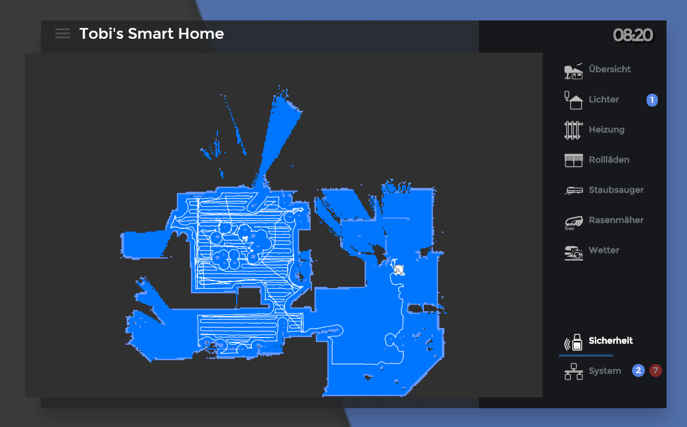

Dieses Scipt ist zum anzeigen der Saugkarte vom Rockrobo 1 und 2.


## UPDATE 15.05.2019:
ab Valetudo 3.X muss die V3_X.js genommen werden,da sich das Kartenformat geändert hat.
## UPDATE 11.12.2018:
Canvas hat ein update auf die version 2.x.x bekommen. Hier funktioniert die map.js nicht mehr, statdessen muss die new_canvas2.js verwendet werden
## Installation

1. kopiere den Inhalt der "map.js" in ein neues script in deinem Javascript Adapter (noch nicht starten)
2. führe in der Konsole folgenen Befehl aus (Ubuntu und Debian): 
```
sudo apt install build-essential libcairo2-dev libpango1.0-dev libjpeg-dev libgif-dev librsvg2-dev 
```
Bei anderen Systemen Schaue [HIER](https://github.com/Automattic/node-canvas/wiki/_pages)

3. Füge folgende NPM Pakete in der Javascript Instanz hinzu: "canvas" und "xmlhttprequest"

4. Installiere [Valetudo](https://github.com/Hypfer/Valetudo) auf deinem [gerooteten](https://github.com/dgiese/dustcloud/wiki/VacuumRobots-manual-update-root-Howto) Sauger 


## Config
im Scrpt muss dann noch die ip des Saugers und der State vom mihomeadapter eingegeben werden. 

Je nach Valetudo version muss dar Pfad von full auf latest geändert werden

### Ergebnis
Es wird ein Object angelegt, welches ein HTML Bild enthält. 
In vis ein HTML Widget nehmen und {javascript.0."PFAD DER KARTE"}
BSP:
```
[{"tpl":"tplHtml","data":{"g_fixed":true,"g_visibility":false,"g_css_font_text":true,"g_css_background":false,"g_css_shadow_padding":false,"g_css_border":false,"g_gestures":false,"g_signals":false,"g_last_change":false,"visibility-cond":"==","visibility-val":1,"visibility-groups-action":"hide","refreshInterval":"0","signals-cond-0":"==","signals-val-0":true,"signals-icon-0":"/vis/signals/lowbattery.png","signals-icon-size-0":0,"signals-blink-0":false,"signals-horz-0":0,"signals-vert-0":0,"signals-hide-edit-0":false,"signals-cond-1":"==","signals-val-1":true,"signals-icon-1":"/vis/signals/lowbattery.png","signals-icon-size-1":0,"signals-blink-1":false,"signals-horz-1":0,"signals-vert-1":0,"signals-hide-edit-1":false,"signals-cond-2":"==","signals-val-2":true,"signals-icon-2":"/vis/signals/lowbattery.png","signals-icon-size-2":0,"signals-blink-2":false,"signals-horz-2":0,"signals-vert-2":0,"signals-hide-edit-2":false,"lc-type":"last-change","lc-is-interval":true,"lc-is-moment":false,"lc-format":"","lc-position-vert":"top","lc-position-horz":"right","lc-offset-vert":0,"lc-offset-horz":0,"lc-font-size":"12px","lc-font-family":"","lc-font-style":"","lc-bkg-color":"","lc-color":"","lc-border-width":"0","lc-border-style":"","lc-border-color":"","lc-border-radius":10,"lc-zindex":0,"html":"{javascript.0.vis.RockroboMap}","class":""},"style":{"left":"0px","top":"76px","width":"100%","height":"calc(100% - 80px)","text-align":"center","z-index":"0"},"widgetSet":"basic"}]
```


