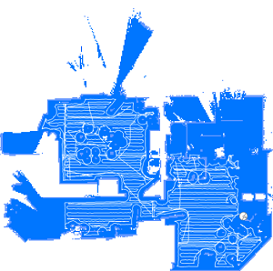

Dieses Scipt ist zum anzeigen der Saugkarte vom Rockrobo 1 und 2.



## Installation
1. kopiere den Inhalt der "map.js" in ein neues script in deinem Javascript Adapter (noch nicht starten)
2. führe in der Konsole folgenen Befehl aus (Ubuntu und Debian): 
```
sudo apt install build-essential libcairo2-dev libpango1.0-dev libjpeg-dev libgif-dev librsvg2-dev 
```
Bei anderen Systemen Schaue [HIER](https://github.com/Automattic/node-canvas/wiki/_pages)

3. Füge folgende NPM Pakete in der Javascript Instanz hinzu: "canvas" und "xmlhttprequest"

4. Installiere [Valetudo](https://github.com/Hypfer/Valetudo) auf deinem [gerooteten](https://github.com/dgiese/dustcloud/wiki/VacuumRobots-manual-update-root-Howto) Sauger 


## Config
im Scrpt muss dann noch die ip des Saugers und der State vom mihomeadapter eingegeben werden. 

Je nach Valetudo version muss dar Pfad von full auf latest geändert werden

### Ergebnis
Es wird ein Object angelegt, welches ein HTML Bild enthält. 
In vis ein HTML Widget nehmen und {javascript.0."PFAD DER KARTE"}

